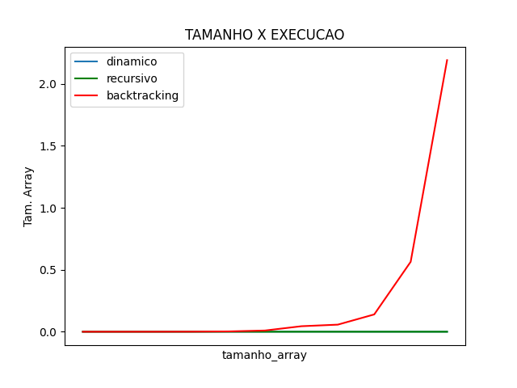

# Este projeto implementa as 3 formas de soluções subset Sum

    - Dinamico
    - Recursivo
    - backtracking

# melhorias 
 - apresentar todos os subconjuntos  do backtracking, até momento ele conta quantos sub conjunto sao possiveis
 - [x] o plot do grafico nao está nomeando por metodo (concluido) 

# Execução
    - instale o as dependencias nescessárias pip install -r requirements.txt
    - o programa pega o conjunto do arquivo conjuntos.txt, para alterar o conjunto altere o arquivo
      sempre respeitando as virgulas.

    - Para gerar o gráfico primeiro, gere o csv!

# Gráfico de Complexidade

    